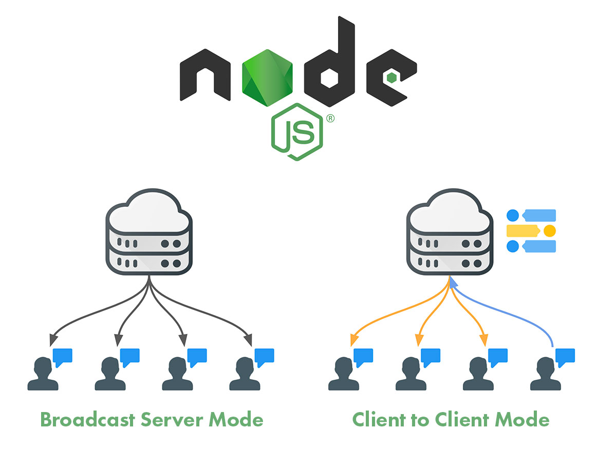

# Tutorial NodeJS Net Socket Server and Clients

[](https://github.com/RichardLitt/standard-readme)
[](https://twitter.com/JoseJ_PR)



## 🔖 Description

The net module provides an asynchronous network API for creating stream-based TCP or IPC servers (net.createServer()) and clients (net.createConnection()).

With this Tutorial you can create a NodeJS Net Server and communicate with severals Clients via Socket.

Official Documentation: [NodeJS | API Net](https://nodejs.org/api/net.html)

## 📹 Video Demo

How to execute a Net Server and two Clients and how the Server send random message to all Clients.

[](https://youtu.be/AQiL8hWZeEg)

How to Execute a Net Server and two Clients and how a Client send random message via Server to others Clients.

[](https://youtu.be/Sfx0kYMzf78)

## ⛅️ Develop in the Cloud

You can run this project in Gitpod, a one-click online IDE for GitHub:

[](https://gitpod.io/#https://github.com/JoseJPR/tutorial-nodejs-net-socket-server-clients)

## 📌 Methodologies and Guidelines

List of methodologies and tools used in this project for compliance with Quality Assurance Code (QAC)

* ESTlint, tool for identifying and reporting on patterns found in ECMAScript/JavaScript code. \
  [NPM ESLint](https://www.npmjs.com/package/eslint) \
  [NPM ESLint | Airbnb](https://www.npmjs.com/package/eslint-config-airbnb)

## ✅ Prerequisites

In order to work with this project, your local environment must have at least the following versions:

* NodeJS Version: 13.xx
* NPM Version: 6.12.0

## 📐 How to work with this project

You have to do the following steps to be able to work with this project.

### 1️⃣ Install NodeJS Dependencies
To work with this project locally it is necessary to install the NPM dependencies.

```bash
# Install npm dependencies
$npm i
```

### 2️⃣ Run

You will find two demos, in the first one, the server emit messages from a "setInterval" function to all the clients subscribed by socket and in the second one a client emit with a "setInterval" function severals message to the server by socket and this is transmitted to the other clients.

#### To run the first demo you need to activate at least ONE Server type Emitter and ONE Client Receiver:

```bash
# Run Server for Emit Messages
$npm run start:first-demo:server-emitter

# Run Client for Receive Message
$npm run start:first-demo:client-receiver
```

#### To run the second demo you need to activate ONE Server Dispatcher, at least ONE Clients Emitter and Others Receivers:

```bash
# Run Server for Receive and Emit Messages
$npm run start:second-demo:server-dispatcher

# Run Client for Emit Messages
$npm run start:second-demo:client-emitter

# Run at least one Client for Receive Messages
$npm run start:second-demo:client-receiver
```

## 📂 Code scaffolding

```any
/
├── assets 🌈               # Images Sources.
├── src 📦                  # Main App with Server and Client.
|   ├── first-demo          # Demo with broadcast demo server sending randoms message to all clients.
|   ├── second-demo         # Demo with a client sending random message via server to all other clients.
|   └── ...
└── ...
```

## ⛽️ Review and Update Dependences

For review and update all npm dependences of this project you need install in global npm package "npm-check-updates" npm module.

```bash
# Install and Run
$npm i -g npm-check-updates
$ncu
```

## License

[MIT](LICENSE.md)

## Happy Code

Created with JavaScript, lot of ❤️ and a few ☕️

## This README.md file has been written keeping in mind

- [GitHub Markdown](https://guides.github.com/features/mastering-markdown/)
- [Emoji Cheat Sheet](https://www.webfx.com/tools/emoji-cheat-sheet/)